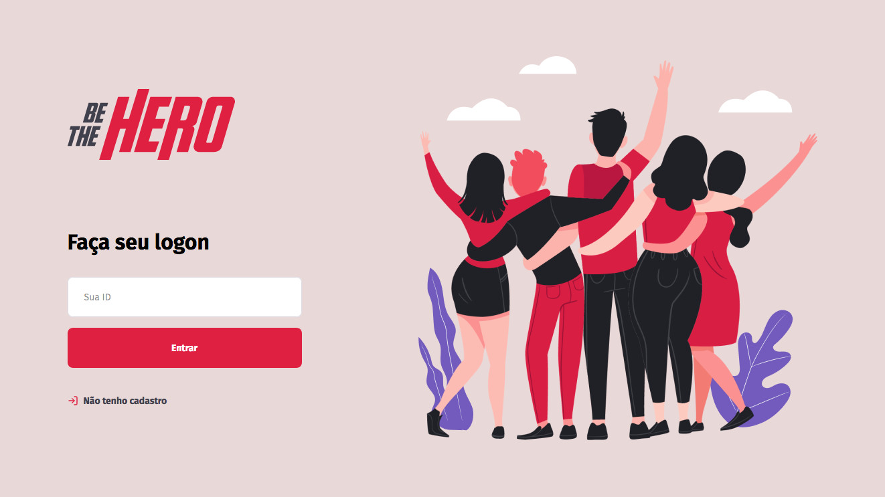
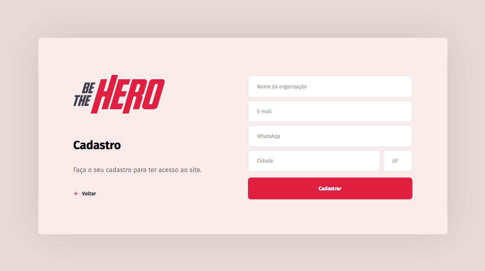
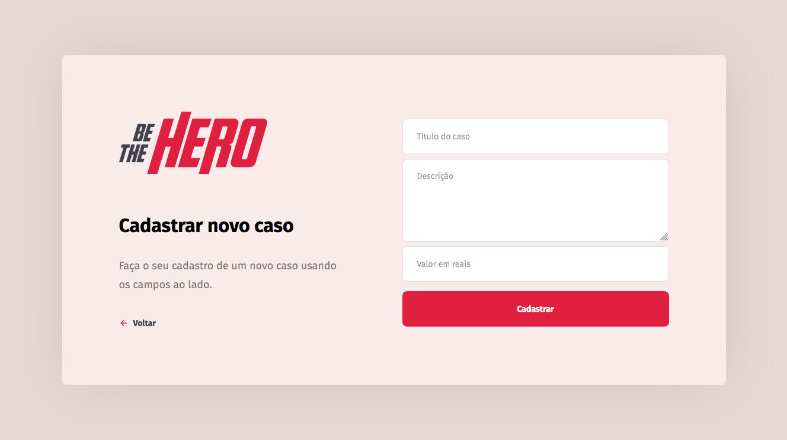
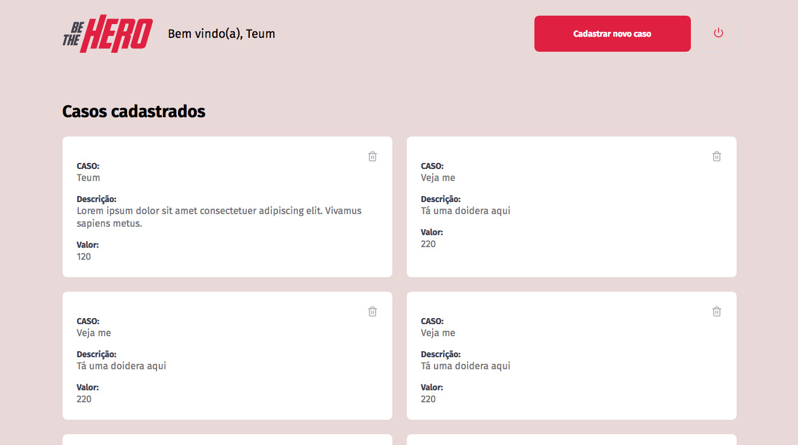

<p align="center">
    
</p>

# Frontend


*Tela inicial.*


*Cadastro de instituição.*


*Cadastro de ocorrências.*


*Listagem de ocorrências. Dados meramente ilustrativos!*

---

## Tecnologias utilizadas
Esta parte do projeto foi desenvolvida utilizando ReactJS.

---

## Para rodar a aplicação:
```shell
  $ yarn install
  $ yarn start
```

---

## Sobre o projeto

O **Be The Hero** é um projeto que visa ajudar instituições que possam estar em dificuldades financeiras. Através do cadastro de ocorrências a instituição expõe o seu problema, mostrando o valor, e um usuário disposto a ajudar pode entrar em contato.

