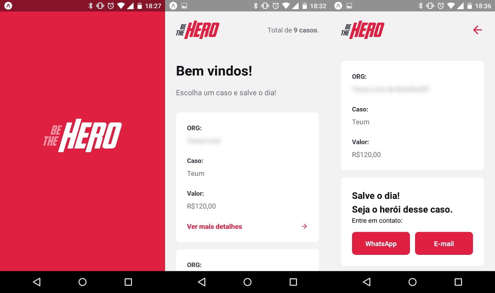

<p align="center">
    
</p>

# Mobile


*Os dados acima são meramente ilustrativos, hahahah...*

---

## Tecnologias utilizadas
Esta parte do projeto foi desenvolvida utilizando React Native e Expo.

---

## Para rodar a aplicação:
```shell
  $ npm install
  $ npm start
```

---

## Sobre o projeto

O **Be The Hero** é um projeto que visa ajudar instituições que possam estar em dificuldades financeiras. Através do cadastro de ocorrências a instituição expõe o seu problema, mostrando o valor, e um usuário disposto a ajudar pode entrar em contato.


